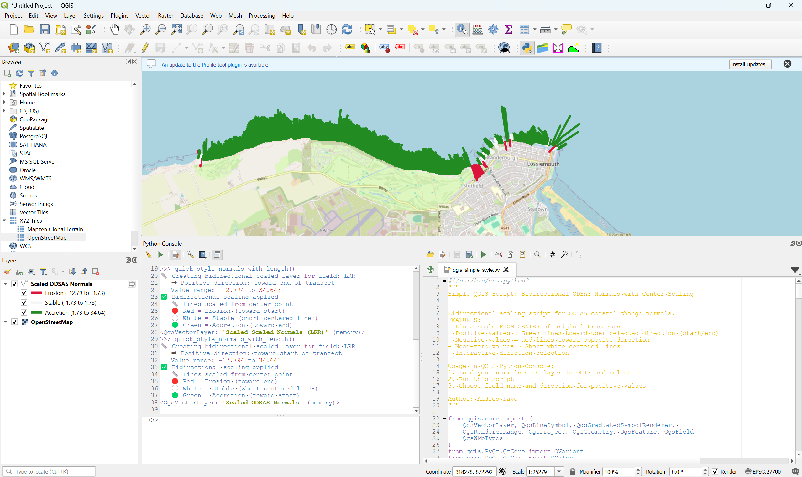

# QGIS Visualization for ODSAS Results


*Example of bidirectional center-scaled visualization showing erosion (red), stable (white), and accretion (green) zones*

This directory contains a QGIS Python script for visualizing ODSAS coastal change analysis results.

## Main Script: `qgis_simple_style.py`

### Purpose
Bidirectional center-scaled visualization of ODSAS shore-normal profiles with:
- **Bidirectional scaling**: Lines extend from CENTER of original transects
- **Sign-based direction**: Positive values (green) toward user-selected direction, negative values (red) toward opposite direction
- **Magnitude representation**: Line length proportional to absolute change magnitude
- **Interactive direction selection**: User chooses direction for positive values (start/end of transect)
- **Centered visualization**: Near-zero values appear as short lines at transect centers
- **Memory layer creation**: Preserves original data while showing scaled visualization

### Supported Coastal Change Metrics
- **NSM**: Net Shoreline Movement (total change in meters)
- **EPR**: End Point Rate (linear rate in m/year)
- **LRR**: Linear Regression Rate (trend rate in m/year)
- **WLR**: Weighted Linear Regression Rate
- **SCE**: Shoreline Change Envelope
- **Any numeric field**: Script can visualize any numeric coastal metric

## Usage Instructions

### Method 1: QGIS Python Console (Recommended)

1. **Open QGIS** and load your ODSAS normals GPKG file
2. **Select the layer** in the Layers panel
3. **Open Python Console**: `Plugins` → `Python Console`
4. **Load and run the script**:
   ```python
   exec(open('path/to/qgis_simple_style.py').read())
   ```
5. **Select coastal metric**: Choose from automatically detected fields (EPR, NSM, LRR, etc.)
6. **Choose positive direction**: Select whether positive values point toward 'start' or 'end' of transects
7. **View results**: Bidirectional center-scaled visualization with clear erosion/accretion patterns

### Method 2: Direct Function Call

After loading the script in QGIS Python Console:
```python
# Run the main styling function
quick_style_normals_with_length()
# Follow prompts for field selection and positive direction
```

### Quick Example

For the Moray example included in this repository:
```python
# From QGIS Python Console (ensure normals layer is selected)
exec(open('qgis_simple_style.py').read())
# Follow prompts to:
# 1. Select EPR, NSM, LRR, or other coastal metric
# 2. Choose direction for positive values (start/end)
```

## Output Visualization

The script creates a **new memory layer** with bidirectionally scaled geometries from transect centers:

### Visual Features
- 🔴 **Red**: Erosion (negative values) extending toward opposite direction from center
- ⚪ **White**: Stable (near-zero values) as short lines centered on original transects
- 🟢 **Green**: Accretion (positive values) extending toward user-selected direction from center

### Bidirectional Center Scaling ⭐ **KEY FEATURE!**
- **Scale origin**: All lines start from **center point** of original transect
- **Direction logic**: Positive/negative values extend in **opposite directions**
- **User control**: Choose whether positive values point toward 'start' or 'end' of transects
- **Magnitude scaling**: Line length represents absolute change (0.1x to 1.0x of half-transect length)
- **Spatial clarity**: Immediate visual distinction between erosion and accretion zones

### Line Properties
- **Origin**: Center point of original transect (fixed reference)
- **Length**: Scaled by absolute change magnitude (10% to 100% of half-transect)
- **Direction**: Sign-dependent (positive vs negative values)
- **Color**: Clear erosion/stable/accretion scheme
- **Style**: Rounded line caps for clean appearance
- **Original layer**: Automatically hidden but preserved

### Legend
Automatically generates a clear legend showing:
- **Erosion/Accretion/Stable categories** with meaningful thresholds
- **Directional consistency** (positive always toward chosen direction)
- **Value ranges** with original field units preserved
- **Color-coded interpretation** for immediate pattern recognition

## Tips for Best Visualization

1. **Layer selection**:
   - **Select your normals layer first** before running the script
   - Script will automatically detect common coastal metrics (NSM, EPR, LRR, etc.)
   - If metrics not found, all fields will be listed for selection

2. **Direction selection**:
   - **Choose 'end'** if you want positive values (accretion) pointing toward offshore/seaward
   - **Choose 'start'** if you want positive values pointing toward onshore/landward
   - **Negative values** will automatically point in the opposite direction

3. **Field selection**:
   - Choose **EPR** or **LRR** for rate-based analysis (m/year)
   - Choose **NSM** for total change magnitude (meters)
   - Any numeric field can be visualized

4. **Interpretation**:
   - **Long red lines**: Significant erosion extending from center
   - **Long green lines**: Significant accretion extending from center
   - **Short white lines**: Minimal change (stable areas) centered on transects
   - **Direction consistency**: All positive values point same way, negatives opposite

5. **Scale considerations**:
   - Center scaling is effective at all zoom levels
   - Directional patterns become immediately obvious
   - Compare relative magnitudes between adjacent transects easily

## Troubleshooting

### Common Issues
1. **"Please select a vector layer first"**: Make sure your normals layer is selected in the Layers panel
2. **"No valid values found"**: Check that the selected field contains numeric data
3. **Empty visualization**: Verify the layer contains line geometries
4. **Direction confusion**: Remember positive/negative directions are relative to your chosen preference

### Field Detection and Direction
The script automatically detects fields containing the terms:
- `NSM`, `EPR`, `LRR`, `WLR`, `SCE` (case insensitive)
- If no coastal metrics found, all available fields are shown
- Direction selection applies to positive values; negative values go automatically opposite

## Example Output

When run with the Moray dataset:
- **Shore-normal profiles** with **bidirectional center-scaled** visualization
- **Clear spatial patterns**: Erosion and accretion zones immediately distinguishable
- **Directional consistency**: All positive values extend toward chosen direction
- **Magnitude assessment**: Line length represents change magnitude from center
- **Interactive setup**: User-friendly prompts for field and direction selection

### Visual Impact
- **Erosion zones**: Appear as red lines extending from centers toward opposite direction
- **Stable sections**: Show as short white lines centered on original transects
- **Accretion zones**: Display as green lines extending from centers toward chosen direction
- **Spatial transitions**: Clear boundaries between erosion/stable/accretion areas
- **Change hotspots**: Immediately obvious through line length from center

## Integration with ODSAS Workflow

This script provides intuitive bidirectional integration with ODSAS++ output:

1. **Run ODSAS analysis** → generates `normals_*.gpkg` 
2. **Open QGIS** → load the normals layer and select it
3. **Run this script** → choose field and positive direction
4. **View results** → instant bidirectional center-scaled visualization
5. **Export maps** → publication-ready figures with clear erosion/accretion patterns

The bidirectional visualization helps identify spatial patterns and transitions in coastal change that are not obvious from traditional symbology or tabular data alone. The center-scaling approach provides immediate visual clarity about both the magnitude and direction of changes relative to each transect position.